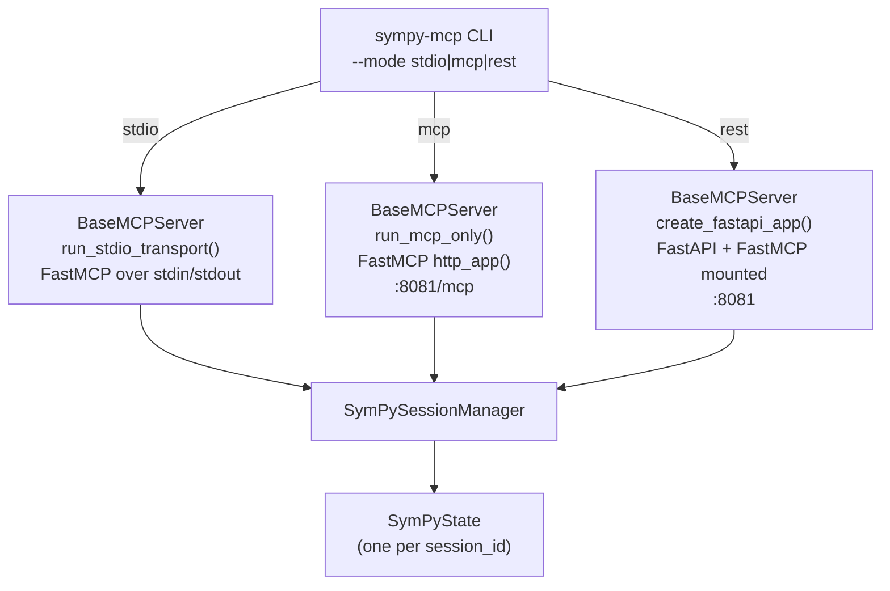
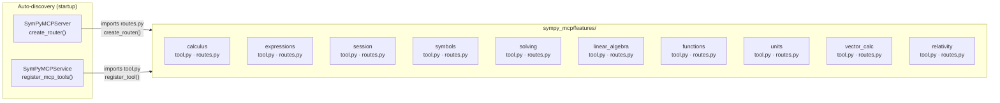
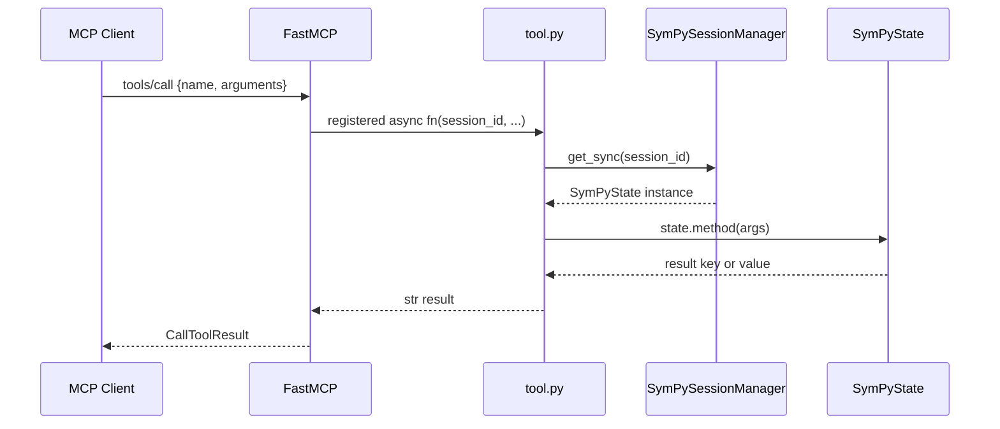
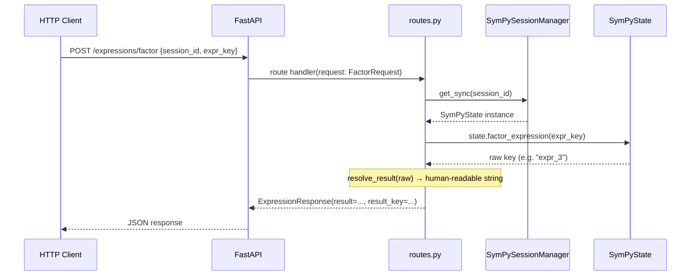
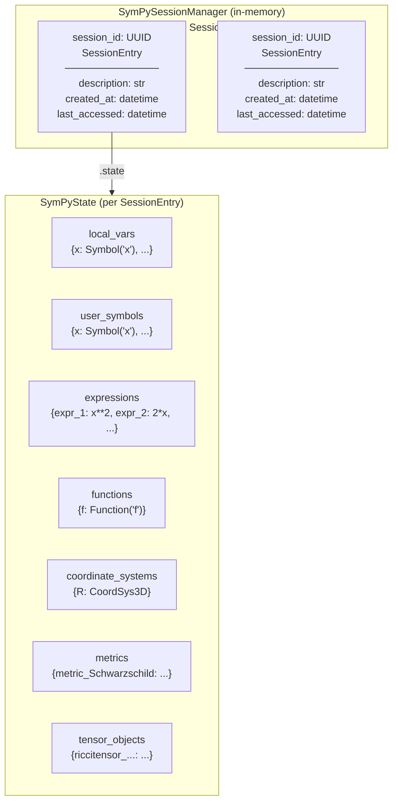
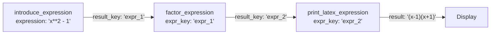
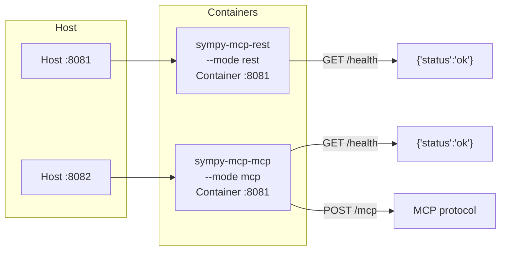

# Architecture

## Overview

`sympy-mcp` is built on a dual-transport architecture: the same symbolic math engine is exposed either as an MCP server (for AI clients) or as a REST API (for HTTP clients), both running from the same codebase.

The entrypoint is the `sympy-mcp` CLI (`sympy_mcp/server.py:main`), which selects a transport mode at startup. All symbolic computation happens in `SymPyState` (one instance per session), managed by `SymPySessionManager`.

---

## Transport Modes



| Mode | Transport | Endpoint | Use case |
|------|-----------|----------|----------|
| `stdio` | stdin/stdout | — | Claude Desktop, Cursor, subprocess clients |
| `mcp` | HTTP | `:8081/mcp` | Cline, HTTP-capable MCP clients, Docker |
| `rest` | HTTP | `:8081/*` | Direct API access, debugging, custom integrations |

In `stdio` and `mcp` modes (`MCP_ONLY=true`), `BaseMCPServer.run_mcp_only()` runs FastMCP's Starlette app directly — the FastAPI router is **not** mounted. A `/health` custom route is registered on the FastMCP instance via `@mcp.custom_route()` so health checks work in all modes.

In `rest` mode, FastAPI wraps a full router (feature routes + `/health` + session management endpoints).

---

## Feature Module Structure

Each capability area is a Python package under `sympy_mcp/features/`. Every feature follows the same three-file convention:

```
sympy_mcp/features/<feature>/
├── instructions.md # Tool descriptions loaded into MCP docstrings at runtime
├── models.py       # Pydantic request/response models
├── routes.py       # REST routes — create_router(session_manager) → APIRouter
└── tool.py         # MCP tools — register_tool(mcp, session_manager)
```

Both `routes.py` and `tool.py` are **auto-discovered** at startup — no manual registration needed when adding a new feature.



### Adding a new feature

1. Create `sympy_mcp/features/<name>/` with `instructions.md`, `models.py`, `routes.py`, `tool.py`
2. Write tool descriptions in `instructions.md` — these are injected as MCP docstrings at runtime
3. Implement `create_router(session_manager) -> APIRouter` in `routes.py`
4. Implement `register_tool(mcp, session_manager)` in `tool.py`
5. Add the computation method to `SymPyState` in `sympy_mcp/state.py`

Both `routes.py` and `tool.py` **must** be updated — they are independent registrations.

---

## Request Flow

### MCP tool call (stdio or HTTP)



### REST API call



---

## Session and State Model

Each unique `session_id` maps to a `SessionEntry` (metadata + an isolated `SymPyState` instance). Sessions must be explicitly created via `create_session` (MCP) or `POST /sessions` (REST), which returns a server-generated UUID. Unknown session IDs are rejected with a `SessionNotFoundError`.

`get_sync()` updates `last_accessed` on every call, enabling future TTL-based eviction (configured via `ttl_seconds` at startup, default 1800 s).



**Key rules:**
- All tool calls sharing state **must** use the same `session_id` — different IDs are completely isolated namespaces
- Session IDs are server-generated UUIDs — clients cannot choose their own
- `user_symbols` tracks only explicitly introduced symbols (via `intro`/`intro_many`); `local_vars` also includes unit constants loaded at init
- Most computation methods return a **key** (e.g. `"expr_3"`) that is stored in `expressions` — pass this key as `expr_key` in subsequent tool calls
- `get_sync()` (used by all tools) touches `last_accessed`; `get()` (async, returns `None` on miss) is available for non-tool code

---

## Result Key Pattern

Computation tools use a key-based chaining pattern to avoid serializing large symbolic expressions across tool calls:



- `result` — human-readable string (for display)
- `result_key` — session storage key (for chaining into the next tool call)

The `series_expansion` tool is a special case: it stores the polynomial (without the big-O term) under the result key, but returns the full series with O() notation in `result` for display.

---

## Docker Compose Services



Both containers are built from the same `Dockerfile`. Dependencies are pre-installed at build time via `uv sync --frozen --no-dev`, so startup is instant with no network access required.
